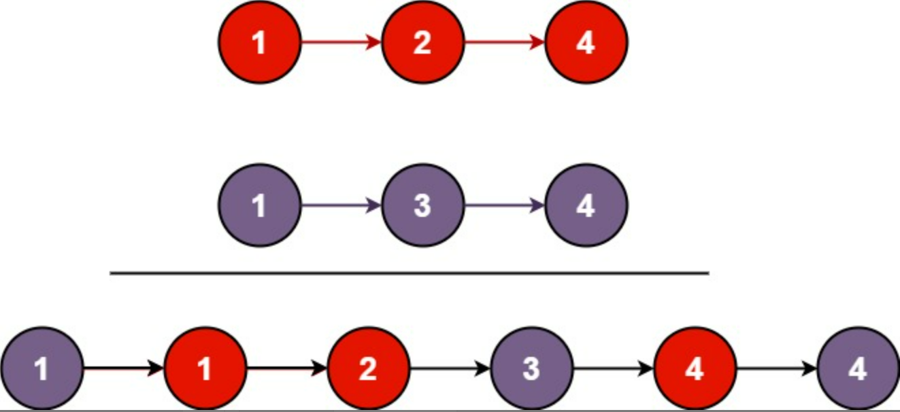

#### 合并两个有序链表

[合并两个有序链表](https://leetcode.cn/problems/merge-two-sorted-lists/)

##### 题目描述

```
将两个升序链表合并为一个新的 升序 链表并返回。
新链表是通过拼接给定的两个链表的所有节点组成的。
示例 1：
输入：l1 = [1,2,4], l2 = [1,3,4]
输出：[1,1,2,3,4,4]
```



- 两个链表的节点数目范围是 `[0, 50]`
- `-100 <= Node.val <= 100`
- `l1` 和 `l2` 均按 **非递减顺序** 排列

##### 解题思路

简单题，没啥说的，类似于双指针，分别遍历两个链表即可

- 时间复杂度：$O(M+N)$.

- 空间复杂度：$O(M+N)$.

```C++
/**
 * Definition for singly-linked list.
 * struct ListNode {
 *     int val;
 *     ListNode *next;
 *     ListNode() : val(0), next(nullptr) {}
 *     ListNode(int x) : val(x), next(nullptr) {}
 *     ListNode(int x, ListNode *next) : val(x), next(next) {}
 * };
 */
class Solution {
public:
    ListNode* mergeTwoLists(ListNode* list1, ListNode* list2) {
        ListNode *head,*tail;
        if(!list1){
            return list2;
        }else if(!list2){
            return list1;
        }
        if(list1->val < list2->val){
            head = list1;
            list1 = list1->next;
        }else{
            head = list2;
            list2 = list2->next;
        }
        tail = head;
        
        while(list1 && list2){
            if(list1->val < list2->val){
                tail->next = list1;
                list1 = list1->next;
            }else{
                tail->next = list2;
                list2 = list2->next;
            }
            tail = tail->next;
        }
        if(list1){
            tail->next = list1;
        }
        if(list2){
            tail->next = list2;
        }

        return head;
    }
};
```
